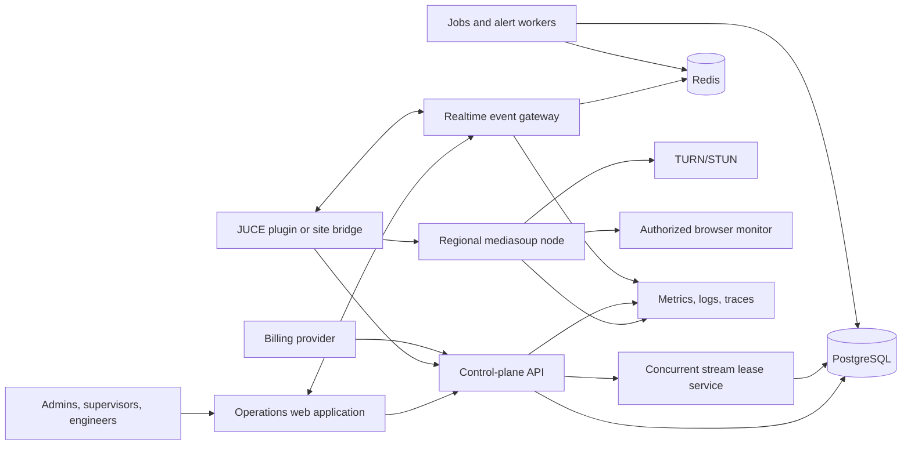

# LiveMixStream Commercial Platform — Whole-System Implementation Plan

## 1. Purpose

Evolve the current LiveMixStream prototype into a commercial, multi-tenant platform for organizations that support PA audio across multiple churches, especially during concurrent Sunday services.

The product allows an organization to:

- Create many administrator, supervisor, engineer, and volunteer accounts.
- Buy a fixed number of **concurrent stream channels** rather than one license per user.
- Assign engineers to church locations and scheduled services.
- Start no more simultaneous live streams than the organization has purchased.
- Monitor every active service from one operations dashboard.
- Reassign or take over a stream when personnel change.
- Receive reliable audio-health, network-health, and operational alerts.
- Keep an auditable record of assignments, stream usage, incidents, and administrative actions.

The initial commercial product is an **operations, assignment, monitoring, and audio-transport layer**. It should work alongside existing console-control applications. Direct control of PA consoles is a later integration unless customer validation proves that it is required for the first paid release.

---

## 2. Product terminology

Use these terms consistently in the UI, API, billing, documentation, and support materials:

- **Organization:** The paying customer or tenant.
- **User:** A person with an account in an organization.
- **Organization owner:** Controls billing and all organization settings.
- **Administrator:** Manages users, locations, entitlements, and assignments.
- **Supervisor:** Monitors active services and can reassign or terminate streams.
- **Engineer/operator:** Manages an assigned service or mix.
- **Local volunteer:** A person at a church who can run checks and communicate with the engineer.
- **Location:** A church, campus, venue, or sanctuary.
- **Endpoint:** An authorized plugin, site bridge, or future hardware appliance.
- **Service event:** A scheduled or ad-hoc church service.
- **Stream channel:** One unit of purchased simultaneous streaming capacity.
- **Stream lease:** A temporary, server-enforced claim on one stream channel.
- **Live session:** The runtime audio/control session associated with a service event.
- **Listener:** A browser or authorized monitoring client consuming audio.

Do not market concurrent capacity as named “seats.” The clearest offer is:

> Create all the team accounts you need and pay for the number of church services streamed simultaneously.

---

## 3. Scope and product boundaries

### 3.1 Commercial v1 scope

- Managed multi-tenant SaaS control plane.
- Organization and user lifecycle.
- Role-based access control.
- Locations, endpoints, recurring service schedules, and engineer assignments.
- Concurrent-stream subscription entitlements.
- Atomic stream-channel allocation, heartbeat, expiry, and release.
- DAW/plugin or site-bridge audio transmission.
- WebRTC browser monitoring with authenticated access.
- Supervisor operations dashboard.
- Objective audio and network telemetry.
- Alerts and pre-service readiness checks.
- Talkback between local site and assigned engineer.
- Durable audit and usage records.
- Billing integration and entitlement synchronization.
- Production deployment, backups, observability, and support tooling.
- Signed plugin installers and an automatic or guided update path.

### 3.2 Explicitly out of scope for initial v1

- Replacing manufacturer mixer-control applications.
- A universal remote-control abstraction for every digital console.
- Sample-accurate remote overdubbing.
- Dolby Atmos or large multichannel post-production workflows.
- Public broadcast-scale listener distribution.
- A mobile-native application unless browser testing proves insufficient.
- Lossless audio as the default internet transport.
- Automated mixing based on machine learning.

### 3.3 Future extensions

- Console integrations for Allen & Heath, Behringer/Midas, Yamaha, DiGiCo, and Soundcraft.
- A managed site appliance with audio interface and secure networking.
- Redundant audio paths and automatic regional failover.
- Recording, compliance retention, and post-service review.
- API and webhooks for scheduling, church-management, and incident systems.
- White-label deployment for large PA service organizations.

---

## 4. Current system baseline

The repository already contains:

- A JUCE C++ plugin built as VST3, AU on macOS, and Standalone.
- Track Control and Streaming plugin modes.
- Sample-by-sample hierarchy gain ramping.
- A loopback-only `MasterHub`/`TrackClient` protocol that coordinates plugin instances on one DAW machine.
- A single-producer/single-consumer audio queue intended to keep network work off the DAW audio thread.
- Opus encoding and RTP transmission from the plugin.
- A Node.js/Express control server.
- WebSocket signaling and a binary WebSocket media fallback.
- A mediasoup SFU using PlainTransport for plugin ingress and WebRtcTransport for browser listeners.
- In-memory sessions, plugin registry, hierarchy, metrics, admin sessions, and audit records.
- Listener, hierarchy, admin, and transmitter-test web pages.
- Docker/Caddy deployment assets.
- Basic Node hierarchy/session tests and one native gain-ramp test.
- Cross-platform CI builds for Linux, macOS, and Windows.

The prototype must not be treated as production-ready yet:

- There is one global admin password rather than individual identities.
- Server state is in memory and disappears on restart.
- There is no organization/tenant boundary.
- There is no purchased-capacity model or atomic lease enforcement.
- Several public REST and WebSocket hierarchy operations can mutate state without user authorization.
- Plugin WebSocket authentication is not consistently enforced.
- Listener links are effectively public possession-based access.
- Rate limiting is process-local.
- One Node process owns API, control WebSockets, fallback media fan-out, and the SFU.
- There is no TURN configuration for difficult NAT/firewall environments.
- Audio telemetry is minimal and not sufficient for PA operations.
- The advertised session bitrate and actual Opus encoder bitrate can differ.
- The SFU currently uses a fixed RTP SSRC for producers and must assign unique values.
- Disconnecting one plugin can clear the entire session hierarchy instead of unregistering only that instance.
- A public `GET /api/session/:id` can create a missing session, enabling phantom sessions and resource abuse.
- The current hybrid path can send RTP/Opus and WebSocket PCM concurrently, doubling uplink use and making audio behavior harder to validate.
- The WebSocket fallback does not provide a clearly negotiated, production-safe framed media protocol.
- Tests do not cover real network impairment, multi-tenancy, lease races, security, reconnects, or sustained audio accuracy.

---

## 5. Target architecture

Separate the product into a durable **control plane** and a regional **media plane**.

### 5.1 Control-plane responsibilities

- Authentication and organization membership.
- Authorization and tenant isolation.
- Locations, endpoints, schedules, assignments, and invitations.
- Subscription and entitlement records.
- Stream-lease allocation and release.
- Session lifecycle and regional routing.
- Audit, notification, reporting, and support operations.
- Short-lived credentials for media nodes and plugin connections.

### 5.2 Media-plane responsibilities

- Receive authenticated RTP/Opus from plugins/site bridges.
- Provide WebRTC audio to authorized monitors.
- Collect RTP, WebRTC, and host-health statistics.
- Enforce session-to-organization routing claims.
- Reject expired or revoked media credentials.
- Emit session-health events to the control plane.
- Remain disposable: durable business state stays in PostgreSQL.

### 5.3 Recommended platform components

- PostgreSQL as the source of truth.
- Redis for distributed presence, pub/sub, short-lived caches, and job queues.
- Object storage for optional diagnostics bundles and recordings.
- A transactional email provider for invitations, password recovery, and alerts.
- A billing provider with subscription and webhook support.
- OpenTelemetry-compatible traces and metrics.
- Central structured logging with organization, location, session, and correlation IDs.

Do not begin by decomposing every domain into microservices. Build a modular control-plane application with clear boundaries, plus separately deployable media nodes and workers. Split further only when measured scaling or team ownership requires it.

---

## 6. Primary user workflows

### 6.1 Organization onboarding

1. Owner creates an organization and verifies email.
2. Owner chooses a concurrent-stream plan.
3. Billing webhook confirms the entitlement.
4. Owner creates locations and rooms.
5. Owner invites administrators, supervisors, engineers, and volunteers.
6. Admin registers an endpoint at each location using a one-time activation code.
7. The endpoint completes a preflight check and appears ready.

### 6.2 Recurring Sunday scheduling

1. Admin creates a recurring service schedule with organization timezone.
2. Admin assigns a primary engineer and optional backup.
3. Assigned personnel receive notifications and can accept or decline.
4. The system opens a configurable preflight window before service.
5. The endpoint and assigned operator run readiness checks.
6. The event becomes eligible to acquire a stream channel.

### 6.3 Starting a service stream

1. Authorized endpoint or operator requests a stream.
2. Control plane checks membership, role, event, endpoint, subscription, and location.
3. Lease service atomically claims one available concurrent stream channel.
4. Control plane creates the live session and returns short-lived media credentials.
5. Plugin sends Opus/RTP to the selected regional media node.
6. Supervisors and assigned engineers receive a live-session event.
7. Heartbeats renew the lease while the session is healthy.

### 6.4 No capacity available

1. Server rejects the start request with a typed `capacity_exhausted` response.
2. UI shows all active leases, operators, locations, and start times.
3. Authorized supervisor may end an obsolete lease or transfer an eligible session.
4. Every forced action is audited.
5. The product never silently exceeds paid concurrent capacity.

### 6.5 Reassignment and takeover

1. Supervisor selects an active service.
2. Supervisor assigns a replacement engineer.
3. New engineer receives access to monitoring and control for that session.
4. Previous engineer loses control immediately but may retain monitor-only access if policy allows.
5. Audio transmission continues without releasing and reacquiring the stream channel.
6. The change is recorded in assignment history and audit logs.

### 6.6 Stream end and recovery

- Normal end releases media resources and the lease immediately.
- Endpoint disconnect starts a grace period rather than immediately destroying the session.
- Reconnect within the grace period resumes the same lease and session.
- Missed heartbeats beyond the lease TTL mark the session stale.
- A reconciliation worker closes media resources and releases stale capacity.
- All release operations are idempotent.

---

## 7. Identity, tenancy, and authorization

### 7.1 Authentication

Implement:

- Individual user accounts.
- Email verification.
- Password hashing using Argon2id or an equivalent current password-hashing standard.
- Password reset with short-lived, single-use tokens.
- Optional passkeys after core authentication is stable.
- TOTP MFA for owners and administrators; require MFA on enterprise plans.
- Secure HTTP-only, same-site cookies for the web application.
- CSRF protection for cookie-authenticated mutations.
- Session rotation after login, privilege change, and password reset.
- Revocation of all sessions from the account security page.
- Brute-force protection backed by Redis, not process memory.

Do not retain bearer tokens in browser `localStorage`.

### 7.2 Organization membership and roles

Use organization-scoped membership records rather than a role stored directly on the user.

Initial roles:

- `owner`
- `admin`
- `supervisor`
- `engineer`
- `volunteer`
- `viewer`

Support location-scoped permissions so an engineer can access only assigned locations. Centralize authorization checks in policy functions and test every role/resource/action combination.

### 7.3 Endpoint authentication

- Admin generates a short-lived one-time activation code.
- Plugin/site bridge exchanges it for an endpoint ID and refresh credential.
- Store refresh credentials in the OS credential store where available.
- Plugin requests short-lived access tokens containing organization, endpoint, location, and permitted actions.
- Media ingress uses separate, session-bound, short-lived credentials.
- Credentials are revocable per endpoint.
- Endpoint identity must not rely on a client-supplied instance ID.

### 7.4 Listener access

Support explicit policies:

- Assigned-team only.
- Organization members.
- Password-protected guest link.
- Expiring signed guest link.

Every listener authorization must resolve to a session and organization. Guest links should be revocable and should never contain long-lived transmitter credentials.

---

## 8. Core data model

Use UUID primary keys internally. Use separate short public identifiers only where humans must type or share them.

### 8.1 Identity and tenancy

- `users`: identity, email, password hash, verification, MFA state, status.
- `organizations`: name, slug, timezone, status, billing customer reference.
- `memberships`: organization, user, role, status, joined timestamp.
- `membership_location_scopes`: membership and permitted location.
- `auth_sessions`: hashed session token, user, expiry, IP/device metadata.
- `invitations`: organization, email, role, location scopes, expiry, inviter.

### 8.2 Church operations

- `locations`: organization, name, address/timezone, status.
- `rooms`: location, name, capacity/notes, status.
- `endpoints`: organization, location/room, type, version, capabilities, status, last seen.
- `service_templates`: recurrence definition, local start time, expected duration, preflight offset.
- `service_events`: materialized occurrence, location/room, scheduled times, status.
- `assignments`: event, user, assignment role, acceptance state, assigned-by.
- `assignment_history`: immutable assignment transitions.

### 8.3 Commercial entitlement

- `plans`: public plan definition and limits.
- `subscriptions`: organization, provider references, state, period dates.
- `entitlements`: organization, key, integer/boolean value, source, validity.
- `stream_leases`: organization, event/session, endpoint, holder, state, acquired/renewed/expires/released timestamps.
- `usage_events`: append-only start, stop, duration, bytes, region, and reason records.

The authoritative capacity value is an entitlement such as `max_concurrent_streams`. Users are not consumed or counted as stream channels.

### 8.4 Runtime and monitoring

- `live_sessions`: organization, event, location, lease, media region/node, status, started/ended timestamps.
- `session_participants`: session, user/guest, role, joined/left timestamps.
- `session_state_transitions`: append-only state changes and reasons.
- `telemetry_rollups`: time bucket, session/endpoint, audio and network aggregates.
- `alerts`: session/location, rule, severity, state, first/last seen, acknowledgement.
- `incidents`: organization, service event, summary, owner, resolution.
- `audit_events`: immutable actor, organization, action, resource, result, correlation ID, metadata.

High-frequency raw telemetry should use a metrics/time-series system with bounded retention. PostgreSQL stores operational rollups and important events, not every audio packet.

### 8.5 Billing and support

- `billing_events`: provider event ID, type, processing state, payload reference.
- `notification_preferences`: user/channel/event preferences.
- `notification_deliveries`: event, recipient, provider state, attempts.
- `support_access_grants`: organization-approved, time-limited support access.

Apply organization IDs to every tenant-owned row and enforce tenant filtering in repository/query layers. Consider PostgreSQL row-level security as defense in depth, not as the only authorization layer.

---

## 9. Concurrent stream lease design

Concurrent capacity is the commercial core and must be correct under races, retries, crashes, and multiple API instances.

### 9.1 Source of truth

Use PostgreSQL transactions as the initial authoritative allocator. Do not make Redis locks or UI state the source of truth.

### 9.2 Acquire algorithm

Within one transaction:

1. Lock the organization entitlement/allocation row using `SELECT ... FOR UPDATE`, or obtain an organization-scoped PostgreSQL advisory transaction lock.
2. Verify subscription and entitlement validity.
3. Mark expired active leases as expired.
4. Check for an existing active lease for the same event/endpoint/idempotency key.
5. Count active, non-expired leases.
6. Reject when the count is at the entitlement limit.
7. Insert one lease with a short TTL and unique idempotency key.
8. Create or attach the live session.
9. Commit before issuing media credentials.

Return the existing result when the same idempotency key is retried.

### 9.3 Lease constraints

- At most one active lease per live session.
- At most one active lease per service event unless a documented redundancy mode allows more.
- A lease belongs to exactly one organization.
- A live session and endpoint must belong to the same organization as the lease.
- Database constraints should enforce relationships that application code could otherwise violate.

Because partial unique indexes cannot use current time reliably, use explicit lease states plus transactional expiry/reconciliation. Treat TTL as operational recovery, not the sole database constraint.

### 9.4 Heartbeat and release

- Endpoint renews approximately every 10 seconds.
- Initial lease TTL: approximately 30–45 seconds, tuned through fault tests.
- Temporary control-plane failure must not interrupt the audio immediately.
- Grace period allows reconnect without consuming a second channel.
- Explicit stop transitions the lease to `released`.
- Subscription suspension blocks new leases but should follow a documented policy for already-live church services; avoid cutting a service midstream solely because a billing webhook arrived.

### 9.5 Reconciliation

A scheduled worker:

- Expires stale leases.
- Closes orphan media producers.
- Repairs sessions whose lease/media state disagree.
- Emits audit and usage events.
- Is safe to run concurrently on multiple worker instances.

### 9.6 Capacity tests

Required tests:

- Hundreds of simultaneous requests for the final available channel produce exactly one successful new lease.
- Duplicate start requests return one lease.
- API crash after commit does not leak additional capacity.
- Media-node crash eventually releases or rehomes the lease according to policy.
- Stale heartbeat expiry and reconnect grace behave deterministically.
- Subscription upgrades become available without restarting services.
- Downgrades do not create an impossible state when current use exceeds the new limit.

---

## 10. Control-plane API

Version the commercial API under `/api/v1`. Publish an OpenAPI document and generate validation/types where practical.

### 10.1 Identity

- `POST /auth/register`
- `POST /auth/login`
- `POST /auth/logout`
- `POST /auth/verify-email`
- `POST /auth/password/forgot`
- `POST /auth/password/reset`
- `POST /auth/mfa/enroll`
- `POST /auth/mfa/verify`
- `GET /me`

### 10.2 Organizations and memberships

- `POST /organizations`
- `GET /organizations/:organizationId`
- `PATCH /organizations/:organizationId`
- `GET /organizations/:organizationId/members`
- `POST /organizations/:organizationId/invitations`
- `PATCH /organizations/:organizationId/members/:membershipId`
- `DELETE /organizations/:organizationId/members/:membershipId`

### 10.3 Locations, endpoints, and scheduling

- CRUD for locations and rooms.
- CRUD for service templates and service events.
- Assignment create, accept, decline, reassign, and cancel operations.
- Endpoint activation-code creation, registration, revocation, and status.
- A preflight endpoint that returns typed check results.

### 10.4 Streaming

- `POST /organizations/:organizationId/stream-leases`
- `POST /stream-leases/:leaseId/heartbeat`
- `POST /stream-leases/:leaseId/release`
- `POST /live-sessions/:sessionId/takeover`
- `POST /live-sessions/:sessionId/end`
- `GET /live-sessions/:sessionId`
- `GET /organizations/:organizationId/live-sessions`
- `POST /live-sessions/:sessionId/listener-token`
- `POST /live-sessions/:sessionId/talkback-token`

### 10.5 Monitoring, audit, and billing

- Active operations summary.
- Session telemetry and alert history.
- Alert acknowledge/resolve.
- Organization audit log with filters and pagination.
- Usage summary by location, day, and concurrent peak.
- Billing checkout/portal endpoints.
- Signed billing webhook endpoint with replay protection.

### 10.6 API behavior

- Validate every request against a schema.
- Use typed error codes such as `capacity_exhausted`, `endpoint_offline`, and `assignment_required`.
- Require idempotency keys for lease acquisition, session end, invitations, and billing-sensitive mutations.
- Include correlation IDs in responses and logs.
- Use cursor pagination for growing collections.
- Never auto-create a session in response to a read operation.

---

## 11. Realtime event model

Replace role selection through unauthenticated query strings with an authenticated realtime connection.

### 11.1 Connection process

1. Client obtains a short-lived realtime ticket from the API.
2. Client connects over WSS and presents the ticket.
3. Gateway binds actor, organization, role, and allowed resource scopes.
4. Client subscribes only to permitted organization/session channels.
5. Authorization is rechecked for privileged commands.

### 11.2 Event envelope

Every event should include:

- Event type and schema version.
- Event ID.
- Organization ID.
- Resource ID.
- Server timestamp.
- Correlation/causation ID.
- Monotonic resource revision where ordering matters.

### 11.3 Core events

- Endpoint online/offline/version changed.
- Service assignment changed.
- Preflight result changed.
- Lease acquired/renewed/released/expired.
- Session starting/live/degraded/reconnecting/ended.
- Engineer joined/left/reassigned.
- Listener count changed.
- Telemetry summary updated.
- Alert opened/acknowledged/resolved.
- Talkback participant state changed.

Clients should recover from missed events by fetching the authoritative snapshot. Events accelerate UI updates; they are not the only state store.

---

## 12. Audio transport and DSP plan

Audio correctness and reliability require measured engineering rather than marketing estimates.

### 12.1 Initial transport profile

- 48 kHz stereo Opus.
- Explicit 10 ms or 20 ms packetization selected through testing.
- Configurable music bitrate with one authoritative value propagated from encoder to session metadata.
- Opus in-band FEC where useful.
- RTP sequence numbers, timestamps, unique random SSRC per producer, and RTCP statistics.
- WebRTC/mediasoup for monitors.
- TURN/TCP/TLS fallback for restrictive networks.

Do not silently send raw PCM through a path identified as Opus. If Opus is unavailable in a release build, fail the streaming capability check clearly or use an explicitly negotiated and tested fallback profile.

### 12.2 Real-time thread rules

The plugin audio callback must:

- Allocate no memory.
- Take no locks.
- Perform no DNS, file, socket, logging, JSON, or encoder work.
- Apply bounded DSP and write to a preallocated lock-free queue.
- Record queue-overrun counters atomically.

Move all encoding, packetization, authentication refresh, reconnect, and telemetry aggregation to worker threads.

### 12.3 Sample-rate and channel handling

- Define 48 kHz stereo as the first supported network profile.
- Add a high-quality asynchronous sample-rate converter when the DAW/device runs at another rate.
- Specify mono-to-stereo and channel mapping behavior.
- Maintain continuous RTP timestamps across normal block-size variation.
- Reset discontinuity state explicitly after device/sample-rate changes.
- Report any dropped or inserted samples.

### 12.4 Objective audio telemetry

Measure and expose:

- Input sample rate, channel count, block size, and codec profile.
- Encoder bitrate and frame duration.
- Queue fill, overruns, underruns, and dropped frames.
- RTP packets/bytes, sequence gaps, late packets, and discontinuities.
- Network RTT, jitter, packet loss, ICE path, and selected candidate type.
- Current and peak listener count.
- End-to-end playout latency measured separately from network RTT.
- Momentary and short-term loudness using ITU-R BS.1770 / EBU R128-compatible processing.
- Integrated loudness over a defined interval.
- Sample peak and dBTP true peak using a documented oversampling method.
- Silence duration, clipping events, channel imbalance, and missing-channel detection.

Label estimated metrics as estimates. Do not present a selected jitter-buffer target as measured end-to-end latency.

### 12.5 Audio alerts

Initial configurable rules:

- No audio/silence beyond threshold.
- Sustained clipping or true peak above threshold.
- Loudness outside expected range.
- One channel missing or severe L/R imbalance.
- Packet loss, jitter, or latency above threshold.
- Queue overrun or encoder failure.
- Endpoint disconnect or outdated plugin.

Use hysteresis and minimum durations to prevent alert flapping.

### 12.6 Talkback

- Use a separate authenticated WebRTC audio producer.
- Keep talkback out of the public listener mix by default.
- Provide push-to-talk and clear active-speaker indication.
- Define routing to local volunteer headphones/monitor bus.
- Add echo-control guidance; do not promise acoustic echo cancellation for arbitrary PA routing.
- Audit supervisor override and talkback session membership, not talkback audio content.

### 12.7 WebSocket fallback

For commercial release, either:

- Implement a versioned media framing protocol with codec, timestamps, sequence numbers, discontinuity flags, and bounded jitter handling; or
- Limit WebSocket fallback to signaling and require WebRTC/TURN for media.

The current implicit interpretation of binary frames is not sufficient for reliable Opus/PCM negotiation.

---

## 13. Plugin and site endpoint plan

### 13.1 Refactor boundaries

Split the current large network implementation into testable components:

- API/auth client.
- Realtime signaling client.
- Audio encoder and resampler.
- RTP packetizer/transport.
- Session state machine.
- Reconnect/backoff controller.
- Telemetry collector.
- Secure credential storage.

Keep platform socket differences behind a transport abstraction.

### 13.2 Commercial plugin workflow

- Sign in or activate using a device code.
- Display organization, location, room, and endpoint identity.
- Show scheduled event and assigned engineer.
- Run preflight.
- Start/stop the authorized service.
- Clearly show acquired capacity, media region, transport state, and health.
- Show actionable errors rather than generic disconnected states.
- Preserve non-secret DAW state while storing credentials outside project files.

### 13.3 Endpoint state machine

Define and test explicit states:

- Unregistered.
- Activated.
- Offline.
- Connecting.
- Ready.
- Preflight failed.
- Awaiting capacity.
- Starting.
- Live.
- Degraded.
- Reconnecting.
- Stopping.
- Ended.
- Revoked.
- Upgrade required.

All transitions should have typed reasons and bounded retry behavior.

### 13.4 Release packaging

- Signed Windows installer and VST3.
- Signed and notarized macOS installer with AU and VST3.
- Linux package/archive only if supported commercially.
- Semantic versioning and protocol compatibility ranges.
- Update manifest signed independently of transport TLS.
- Staged rollout and emergency rollback.
- Crash diagnostics opt-in with privacy disclosure.
- Published supported DAW/OS matrix.

### 13.5 Site bridge option

Validate whether churches use DAWs during services. If not, create a lightweight standalone site bridge that:

- Selects an audio interface input.
- Runs as a service/appliance.
- Starts scheduled streams without opening a DAW.
- Supports local preflight and talkback.
- Can coexist with manufacturer console-control software.

This may become the primary church endpoint while the JUCE plugin remains useful for studio workflows.

---

## 14. Web application plan

Use a maintainable typed frontend rather than extending the current global-script pages indefinitely.

### 14.1 Owner/admin experience

- Organization settings and billing.
- Concurrent capacity and peak-usage history.
- User invitations, roles, and location scopes.
- Locations, rooms, endpoints, and endpoint health.
- Recurring schedule and assignment calendar.
- Audit and security views.

### 14.2 Supervisor operations dashboard

Prioritize a dense operational view:

- Current time and organization timezone.
- Scheduled, preflight, starting, live, degraded, and ended services.
- Location, engineer, backup, endpoint, and duration.
- Concurrent channels used/available.
- Loudness, true peak, silence, loss, jitter, and end-to-end latency.
- Active alerts and acknowledgements.
- Monitor, talkback, reassign, takeover, and end controls.

Do not hide critical status behind decorative visualizations. Every health state needs text, severity, timestamp, and diagnostic detail.

### 14.3 Engineer experience

- “My services” schedule.
- Assignment acceptance.
- Preflight checklist.
- Low-latency authenticated audio monitor.
- Talkback.
- Session health and incident notes.
- Clear escalation to supervisor.

### 14.4 Local volunteer experience

- Simplified endpoint readiness.
- Guided audio test.
- Contact/talkback with assigned engineer.
- Minimal controls with no organization-wide access.

### 14.5 Accessibility and resilience

- Keyboard-operable controls.
- Screen-reader labels and status announcements.
- Status must not rely on color alone.
- Responsive layout for tablets.
- Offline/reconnect indication.
- Snapshot refresh after realtime reconnect.
- Confirmation and reason entry for destructive supervisor actions.

---

## 15. Scheduling and assignment

### 15.1 Recurrence

- Store recurrence definitions with IANA timezone IDs.
- Materialize service events ahead of time.
- Handle daylight-saving transitions explicitly.
- Allow per-event exceptions without mutating the recurring template.
- Store scheduled instants in UTC and preserve local timezone context.

### 15.2 Assignment rules

- Primary and backup engineers.
- Acceptance/decline state.
- Conflict detection for overlapping assignments.
- Optional skill tags and permitted locations.
- Supervisor override with reason.
- Notification escalation when an assignment remains unaccepted.

### 15.3 Preflight

Run before the event:

- Endpoint online and approved version.
- Audio input device present.
- Supported sample rate/channels.
- Signal present on expected channels.
- No clipping during test.
- Server/media region reachable.
- UDP/WebRTC/TURN path test.
- Measured packet loss, jitter, and RTT during a short probe.
- Talkback check.
- Available subscription capacity shown as informational; do not reserve a channel too early unless reservations become a paid policy.

Persist preflight results against the service event and endpoint.

---

## 16. Billing and entitlement management

### 16.1 Product model

Primary billable metric:

- Maximum simultaneous live streams per organization.

Possible secondary limits:

- Managed locations.
- Telemetry retention.
- Recording storage.
- Support tier.
- SSO and self-hosted deployment.

Avoid per-user pricing in the core church operations offer.

### 16.2 Billing lifecycle

- Checkout creates a pending subscription.
- Verified provider webhooks update local subscription state.
- Webhook processing is idempotent by provider event ID.
- Entitlement changes are append-only/auditable.
- Upgrade can apply immediately.
- Downgrade applies at a defined period boundary unless support overrides it.
- Failed payment enters a grace policy.
- Never terminate an active Sunday service without an explicit, customer-visible policy.

### 16.3 Billing tests

- Duplicate and out-of-order webhooks.
- Upgrade/downgrade during active streams.
- Payment recovery.
- Subscription cancellation.
- Provider timeout after successful checkout.
- Manual support entitlement with expiry.

---

## 17. Security and privacy

### 17.1 Immediate prototype issues to close

- Remove the default production admin password.
- Require authentication for every state-changing hierarchy and session operation.
- Authenticate plugin WebSocket upgrades.
- Stop creating sessions from unauthenticated GET/listener requests.
- Restrict CORS to configured origins.
- Replace process-local rate limits.
- Remove secrets from query strings where they may enter logs.
- Validate all JSON and WebSocket message schemas.
- Enforce payload size and command-rate limits.
- Separate health/readiness endpoints from detailed internal metrics.

### 17.2 Production controls

- TLS everywhere; WSS only in production.
- Encryption at rest for databases, backups, and object storage.
- Managed secret store with rotation.
- Least-privilege service identities.
- Signed media and realtime tickets with short expiry and audience claims.
- Tenant-isolation tests at API, realtime, media, and query layers.
- Dependency, container, and secret scanning in CI.
- Software bill of materials for releases.
- Security headers and content security policy.
- Immutable audit events with retention policy.
- Backup restoration drills.
- Incident response and vulnerability disclosure processes.

### 17.3 Privacy

- Define what audio, telemetry, IP, device, and user data is collected.
- Default to no audio recording.
- Make recording explicit and visible to participants.
- Provide retention controls and deletion/export workflows.
- Obtain legal review for customer terms, privacy policy, and church/volunteer use.

---

## 18. Reliability, scaling, and deployment

### 18.1 Environments

- Local development.
- Automated test.
- Staging with real public networking/TURN.
- Production with separate control and media planes.

Use infrastructure as code and separate secrets per environment.

### 18.2 Control plane

- Multiple stateless API instances behind a load balancer.
- Multiple realtime gateways using Redis pub/sub or streams.
- PostgreSQL with automated backups and point-in-time recovery.
- Redis with managed persistence/HA appropriate to its role.
- Workers with idempotent jobs and dead-letter handling.

### 18.3 Media plane

- Media nodes registered by region and capacity.
- Health-aware session placement.
- Unique port allocation and producer identifiers.
- TURN in each supported region.
- Drain mode for maintenance.
- Per-node CPU, memory, bandwidth, packet, and transport metrics.
- Initially pin a live session to one node; design later redundancy from measurements.

### 18.4 Failure policies

Document behavior for:

- API unavailable while audio is live.
- Realtime gateway restart.
- Redis unavailable.
- Database unavailable.
- Media worker/node crash.
- TURN outage.
- Endpoint network change.
- Plugin/DAW crash.
- Billing provider outage.

Existing audio should continue through short control-plane interruptions whenever credentials and media path remain valid.

### 18.5 Service objectives

Define measurable pilot objectives before making commercial claims:

- Control-plane availability.
- Successful session-start rate.
- Time from start request to monitorable audio.
- Reconnect success and duration.
- Audio dropout rate under defined network conditions.
- Alert-detection delay.
- Lease-allocation correctness.

Set numerical SLOs only after staging and pilot measurements establish credible baselines.

---

## 19. Observability and support

### 19.1 Structured context

Attach these where applicable:

- Correlation ID.
- Organization ID.
- Location and endpoint ID.
- Service event and live session ID.
- Lease ID.
- Media region/node.
- Plugin version and OS.

Never log passwords, refresh credentials, guest secrets, raw audio, or full bearer tokens.

### 19.2 Operational dashboards

- Session starts, failures, and failure reasons.
- Active leases versus entitlement.
- Media node capacity and saturation.
- Packet loss, jitter, latency, and dropout distributions.
- Endpoint/plugin versions.
- Alert volume and acknowledgement time.
- Billing webhook failures.
- API/realtime error rates and latency.

### 19.3 Support tooling

- Search organization, endpoint, event, and session.
- View a redacted timeline.
- Revoke endpoint or user sessions.
- Reprocess safe billing events.
- Grant time-limited, customer-approved support access.
- Export a diagnostics bundle with explicit user consent.
- Audit every support action.

---

## 20. Testing and precise audio validation

### 20.1 Test layers

- Unit tests for domain policies, recurrence, authorization, DSP, packetization, and state machines.
- Database integration tests for constraints, migrations, lease transactions, and tenant isolation.
- API contract tests from the OpenAPI specification.
- Realtime protocol tests for authentication, ordering, reconnect, and snapshot recovery.
- Media integration tests with real mediasoup and TURN.
- Plugin host tests across supported DAWs and block sizes.
- End-to-end browser tests for admin, supervisor, engineer, and volunteer workflows.
- Load, soak, chaos, and security tests.

### 20.2 Deterministic audio test harness

Build a native/headless transmitter and receiver capable of:

- Generating impulses, tones, sweeps, pink noise, silence, and reference audio.
- Capturing the decoded result.
- Comparing timing, level, channel mapping, discontinuities, and spectral error.
- Running with reproducible network-impairment profiles.
- Producing machine-readable results and waveform/spectrum artifacts.

Test:

- 44.1, 48, 88.2, and 96 kHz host rates converted to the network profile.
- Mono and stereo inputs.
- DAW block sizes from small/irregular through large.
- Long uninterrupted runs.
- Encoder bitrate/frame changes.
- Reconnect and network path changes.
- Queue overrun/underrun.
- Packet loss, duplication, reordering, jitter, and burst loss.
- CPU pressure and media-node saturation.

### 20.3 Measurement definitions

Document exactly:

- Where latency timestamps are captured.
- Whether latency is one-way, round-trip, target buffer, or measured playout.
- Loudness gating and integration windows.
- True-peak oversampling/filter method.
- Dropout threshold and counting rules.
- Clock-drift measurement and correction.

### 20.4 Required release evidence

- No audio-thread allocation or blocking detected under supported hosts.
- No unexplained sample discontinuities in clean-network tests.
- Known degradation curves under packet loss/jitter profiles.
- Lease limit remains exact under concurrency/load tests.
- Cross-tenant access attempts fail at every interface.
- Multi-hour Sunday-shaped soak test passes with realistic concurrent sessions.
- Restore-from-backup and media-node drain drills succeed.

---

## 21. CI/CD and release engineering

Extend the existing CI to include:

- Formatting, linting, static analysis, and compiler warnings as errors where practical.
- Node/control-plane unit and integration tests.
- PostgreSQL/Redis service tests.
- Native DSP/network tests on all supported OSes.
- Sanitizer builds on Linux/macOS.
- Plugin validation tools.
- Dependency, secret, and container scanning.
- Reproducible version stamping.
- Signed/notarized release artifacts.
- Staging deployment with smoke tests.
- Database migration compatibility and rollback checks.
- Protocol compatibility tests between current and previous supported plugin versions.

Use canary deployments for the control plane and drain media nodes before replacement. Database migrations must use expand/migrate/contract sequencing so old and new application versions can overlap safely.

---

## 22. Migration from the current prototype

Preserve useful DSP and transport work, but avoid incrementally burying multi-tenancy inside the current `server/index.js`.

### 22.1 Preserve and harden

- JUCE processor/editor foundations.
- Lock-free audio handoff concept.
- Gain-ramp behavior.
- Opus/RTP direction.
- mediasoup browser consumption.
- Existing web UX as a behavior reference.
- Docker and cross-platform CI foundations.

### 22.2 Replace or refactor

- In-memory maps become durable repositories plus distributed presence.
- Global password becomes individual authentication and organization membership.
- Global admin dashboard becomes tenant-scoped operations UI.
- Session IDs/tokens become durable session records and short-lived scoped credentials.
- Open hierarchy mutation becomes authorized, assignment-aware commands.
- Monolithic server is split into modules for identity, organizations, scheduling, leases, sessions, telemetry, billing, and audit.
- Large header-only network client is decomposed into testable transport/state components.
- Implicit fallback framing becomes an explicit protocol or is removed.

### 22.3 Compatibility strategy

- Freeze the prototype protocol as version `0`.
- Add explicit protocol version negotiation.
- Commercial API and realtime protocol begin at `v1`.
- Reject incompatible clients with an actionable upgrade message.
- Do not carry prototype bearer tokens into the commercial credential model.

---

## 23. Phased implementation roadmap

Each phase ends with demonstrable acceptance criteria. Do not start paid production before the release gates in Phase 10.

### Phase 0 — Customer and workflow validation

Deliver:

- Interviews with PA service organizations and multi-site churches.
- Current Sunday workflow map.
- Inventory of consoles, DAWs, audio interfaces, networks, and control software.
- Peak-concurrency and staffing data.
- Confirmation whether a DAW plugin or standalone site bridge is the correct endpoint.
- Pilot partners and written success criteria.

Exit criteria:

- At least two pilot organizations confirm the concurrent-stream model.
- One narrowly defined v1 workflow is agreed.
- Console control is explicitly classified as required or external for v1.

### Phase 0A — Prototype stabilization before any live pilot

This phase may run in parallel with customer validation, but it must finish before the prototype is used during a real service.

Deliver:

- Change plugin disconnect handling so only the disconnected instance is unregistered; preserve all other hierarchy members and their last commanded gains.
- Make unknown-session reads return `404`; create sessions only through an authenticated mutation.
- Require scoped authorization for all hierarchy mutations over REST and WebSocket.
- Require authenticated endpoint identity for plugin WebSocket connections.
- Remove the default production admin credential and fail startup when required production secrets are absent.
- Generate a unique RTP SSRC for each producer.
- Select exactly one negotiated media path per session; stop transmitting PCM fallback concurrently when RTP/WebRTC is active.
- Align “lead” terminology with actual independent duck/unduck behavior, or implement and test an explicit exclusive-lead group mode.
- Add integration tests for these fixes plus structured liveness/readiness endpoints and correlation-aware logs.

Exit criteria:

- Disconnecting one Track Control plugin does not alter other registered tracks or their gain state.
- Anonymous clients cannot create sessions or change a mix.
- Ten simultaneous sessions use distinct RTP producer identities.
- Network capture confirms one media path per session.
- One complete rehearsal runs without hierarchy loss, phantom sessions, or unauthorized control.

### Phase 1 — Repository and protocol foundation

Deliver:

- Modular server structure.
- Typed configuration and request/event schemas.
- PostgreSQL migrations and repository layer.
- Redis integration.
- Versioned API and realtime event envelopes.
- Local development stack.
- Expanded CI and test framework.

Exit criteria:

- Schema migrations run from empty database.
- API starts with PostgreSQL/Redis dependencies.
- Contract and integration tests run in CI.
- Existing prototype functionality remains available only through a clearly isolated compatibility path.

### Phase 2 — Multi-tenant identity and RBAC

Deliver:

- Users, organizations, memberships, invitations, roles, location scopes.
- Secure browser sessions, verification, reset, and admin MFA.
- Tenant-aware audit events.
- Endpoint activation and revocation.

Exit criteria:

- Role policy matrix is fully tested.
- Cross-tenant API and realtime tests pass.
- No production default credentials.

### Phase 3 — Locations, scheduling, and assignments

Deliver:

- Locations, rooms, endpoints, service templates/events.
- Timezone-safe recurrence.
- Primary/backup assignments and acceptance.
- Notifications and conflict detection.
- Basic calendar and “My services” views.

Exit criteria:

- A full recurring Sunday schedule can be created and exceptions handled.
- Assignment changes are realtime and auditable.

### Phase 4 — Entitlements and concurrent lease enforcement

Deliver:

- Plans, subscriptions, entitlements, stream leases, usage events.
- Transactional acquire/heartbeat/release/reconciliation.
- Capacity UI and typed errors.
- Support overrides with expiry and audit.

Exit criteria:

- Final-channel race tests never exceed entitlement.
- Crash/retry/reconnect tests do not leak leases.
- Supervisor can identify and safely release stale capacity.

### Phase 5 — Authenticated media path

Deliver:

- Session-bound media credentials.
- Regional node registry and placement.
- Unique RTP identifiers and correct codec metadata.
- TURN deployment.
- Authenticated WebRTC monitoring.
- Versioned endpoint state machine and reconnect behavior.

Exit criteria:

- Unauthorized producer/consumer attempts fail.
- Media survives tested short control-plane interruptions.
- Public-network tests pass through direct UDP and TURN fallback.

### Phase 6 — Precise telemetry, preflight, and alerts

Deliver:

- Audio/network telemetry pipeline.
- Standards-defined loudness and true-peak measurement.
- Queue/dropout/discontinuity counters.
- Preflight workflow.
- Alert rules, hysteresis, acknowledgement, and history.

Exit criteria:

- Metrics match reference test vectors/tolerances.
- Injected silence, clipping, packet loss, and endpoint failure create correct alerts.
- Dashboard distinguishes measured latency from configured buffering.

### Phase 7 — Operations dashboard and reassignment

Deliver:

- Organization operations dashboard.
- Active service/capacity overview.
- Monitor controls.
- Engineer join/reassign/takeover.
- Incident notes and timeline.
- Mobile/tablet-responsive volunteer workflow.

Exit criteria:

- Supervisor can operate multiple simultaneous simulated Sunday services.
- Reassignment changes permissions without interrupting audio.
- Destructive actions require authorization, confirmation, reason, and audit.

### Phase 8 — Talkback and endpoint productization

Deliver:

- Separate talkback path.
- Plugin/site-bridge commercial workflow.
- Secure credential storage.
- Signed installers, update mechanism, compatibility policy.
- Supported environment matrix.

Exit criteria:

- Talkback routing cannot leak into public listener output under tested configurations.
- Installation and activation succeed on supported systems without developer tools.
- Upgrade and rollback paths are tested.

### Phase 9 — Billing, production operations, and support

Deliver:

- Billing checkout/portal/webhooks.
- Grace, upgrade, downgrade, and cancellation policies.
- Production infrastructure as code.
- Backup/PITR and restoration.
- Observability, paging, runbooks, and support tooling.
- Privacy/terms/retention controls.

Exit criteria:

- Billing replay/out-of-order tests pass.
- Restoration and incident drills pass.
- Production dashboards and alerts cover defined SLO indicators.

### Phase 10 — Pilot and commercial release

Deliver:

- Staged pilots with real Sunday services.
- Baseline performance and reliability reports.
- Defect prioritization and release-candidate hardening.
- Onboarding, operator training, support process, and status page.

Exit criteria:

- Multiple consecutive Sunday pilots meet agreed success criteria.
- No unresolved critical security, capacity, audio-integrity, or data-loss defects.
- Support can diagnose a session from its timeline and metrics.
- Rollback, revocation, and customer communication procedures are rehearsed.

### Phase 11 — Console integrations

Only after v1 validation:

- Select the first console family based on pilot usage.
- Build a capability-based adapter model.
- Start read-only with scene/channel/meter discovery.
- Add guarded write controls with explicit permissions and confirmation.
- Test against real hardware and manufacturer firmware versions.
- Keep control commands separated from audio transport and enforce local fail-safe behavior.

---

## 24. Release gates

The product is not commercially ready until all applicable gates pass:

### Functional

- Organization can onboard without developer intervention.
- Admin can manage users, locations, schedules, and assignments.
- Concurrent capacity is enforced atomically.
- Supervisor can monitor, reassign, and end streams.
- Endpoint reconnect and stale lease recovery work.

### Audio

- Supported transport profile is documented and measured.
- Bitrate/sample-rate/channel metadata matches actual encoding.
- No silent codec fallback.
- Audio-thread safety is verified.
- Network impairment and long-duration tests pass agreed thresholds.

### Security

- Independent identities and tenant isolation.
- All mutations authenticated and authorized.
- Endpoint/media credentials scoped and revocable.
- Security review and dependency scan have no unresolved critical findings.

### Operations

- Backups and restoration tested.
- Production monitoring and paging operational.
- Media-node drain/replacement tested.
- Runbooks exist for capacity, media, auth, database, billing, and endpoint incidents.

### Commercial

- Billing and entitlement lifecycle tested.
- Terms, privacy, support boundaries, and retention documented.
- Pilot customers confirm value and pricing model.

---

## 25. Key product decisions required

Resolve these during Phase 0–1:

1. Is the primary endpoint a DAW plugin, standalone desktop bridge, or managed appliance?
2. Does v1 only coordinate monitoring while engineers use manufacturer console software, or must it directly control a console?
3. Which console brands and control workflows dominate pilot customers?
4. Is the default stream a PA mix, a dedicated monitor bus, or selectable stems?
5. Who may listen: assigned engineer only, supervisors, local volunteers, or guests?
6. Is talkback required for the first pilot?
7. What grace period should apply to endpoint disconnects and billing failures?
8. How many locations, simultaneous services, and supervisors define the first realistic load target?
9. What regions must be supported at launch?
10. What telemetry retention and support access will customers accept?
11. Is cloud-only acceptable, or is self-hosting required by target organizations?
12. Are services expected to run without a DAW?

---

## 26. Recommended first vertical slice

Build one end-to-end scenario before broad feature work:

1. One organization with an owner, supervisor, and two engineers.
2. Two church locations and scheduled service events.
3. A subscription entitlement for one concurrent stream.
4. Activated standalone/plugin endpoints.
5. Transactional lease acquisition that permits only one active service.
6. Authenticated Opus stream to one media node.
7. Assigned engineer monitors through WebRTC.
8. Supervisor sees measured health and reassigns the engineer.
9. Endpoint stops; lease releases; second location can start.
10. Every action appears in durable audit and usage history.

This slice proves the unique commercial value—shared concurrent capacity plus centralized church operations—before adding broad integrations or advanced features.

---

## 27. Definition of success

LiveMixStream succeeds as a commercial product when a PA service organization can manage many users and church locations while purchasing only its true peak simultaneous streaming requirement; supervisors can see and intervene in every active Sunday service; engineers receive reliable, precisely measured monitoring audio; and the platform enforces security, tenant boundaries, and capacity without manual intervention or hidden audio degradation.
